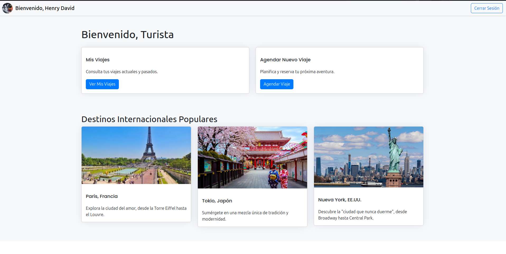
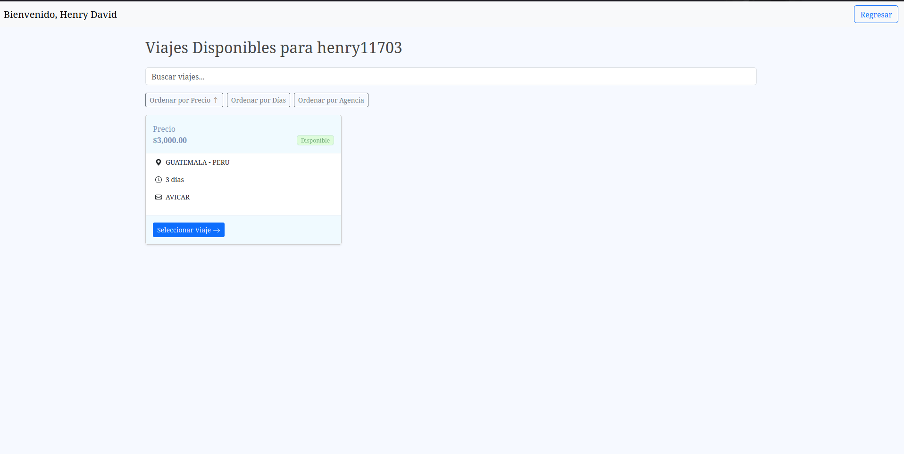
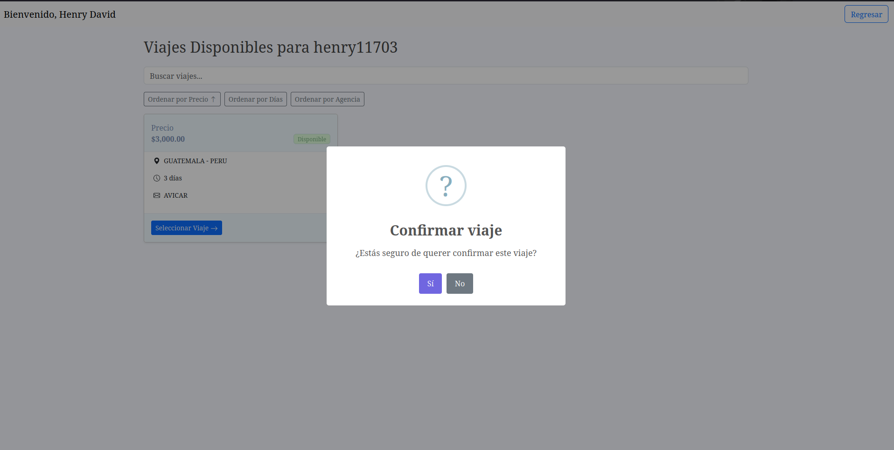
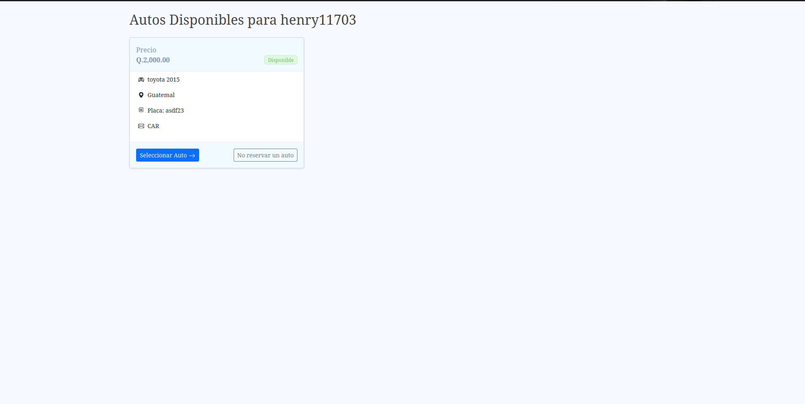
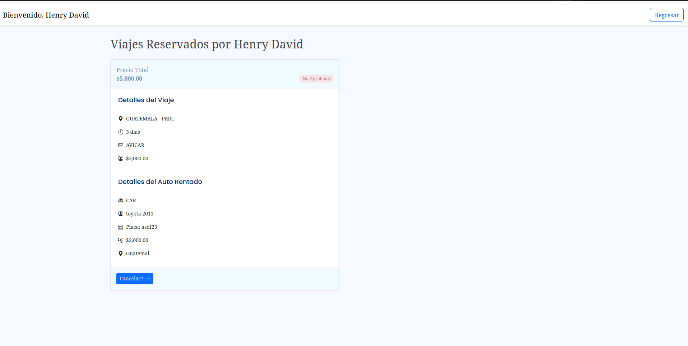

# Inicio

El entrar a la pagina se encontrara con el menu del login, al que al ingresar credenciales correctas redirige hacia el menu principal

desde este menu se Encuentra con varias opciones en las que se puede reservar un viaje o consultar los viajes ya reservados para confirmar o eliminar

Al seleccionar el menu de agendar un viaje se redirecciona hacia esta pantalla donde se podran ver todos los viajes que existan

al seleccionar un viaje se mostrara una pantalla de confirmacion y seremos redirigidos hacia la pestaña para reservar un auto si se desea o no

y estando aca se puede registrar un auto o no, y ya se guardan los datos de la reserva para que se puedan observar desde el menu de reservas

Y para que este sea aprobado se debe esperar un poco, ya que se encargan los usuarios recepconistas de aprobarlo